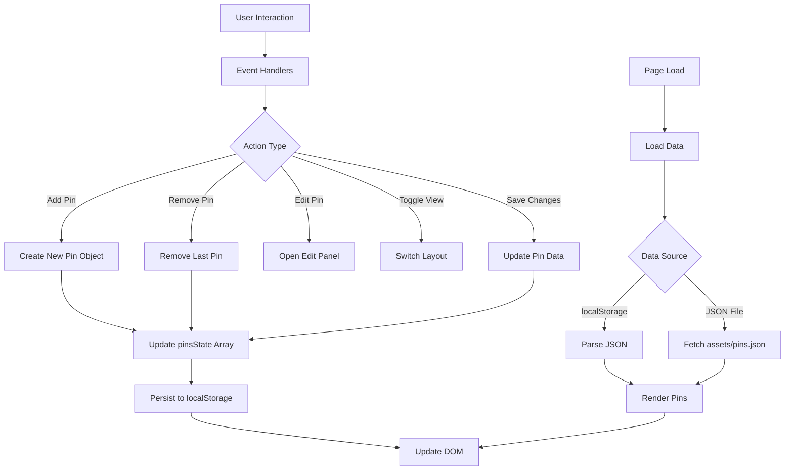

# Assignment 01: PinBoard Interactive Web Application

## Brief
Starting from the concept of a pinboard, implement a web page that:
- is responsive (properly layout for smartphone, tablet, and desktop)
- allows the user to add and remove elements
- allows the user to customize elements (i.e. colors, size)
- allows the switch between two views (at least)

## Screenshots

### Grid View

### List View

### Edit Panel

## Project Description

The PinBoard application is an interactive web interface for managing digital notes/pins with customizable visual properties. Users can toggle between grid and list layouts, add new pins, remove existing ones, and edit pin content through a slide-up panel. The application features responsive design for mobile and tablet devices, with data persistence across browser sessions using localStorage and JSON file fallback. Functional logic includes DOM manipulation for dynamic pin creation/rendering, event handling for user interactions, and state management for pin data. Interaction modalities comprise click-to-edit pins, toggle switches for view modes, and form-based editing with real-time preview. (248 characters)

## Block Diagram

## Functions List

### Utility Functions

#### `cacheElements()`
- **Arguments**: None
- **Description**: Caches DOM elements into the elements object for performance
- **Returns**: void

#### `generatePinId()`
- **Arguments**: None
- **Description**: Generates a unique ID for new pins
- **Returns**: string

#### `validateRequiredFields(title, text)`
- **Arguments**: `title` (string), `text` (string)
- **Description**: Validates that title and text fields are not empty, adds error classes if invalid
- **Returns**: boolean

#### `clearValidationErrors()`
- **Arguments**: None
- **Description**: Removes validation error classes from title and text fields
- **Returns**: void

#### `readFileAsBase64(file)`
- **Arguments**: `file` (File)
- **Description**: Reads a file as base64 data URL
- **Returns**: Promise<{data: string, type: string}>

#### `resizeImage(file, maxWidth, maxHeight)`
- **Arguments**: `file` (File), `maxWidth` (number), `maxHeight` (number)
- **Description**: Resizes an image to fit within max dimensions and returns a blob
- **Returns**: Promise<Blob>

### Pin DOM Manipulation

#### `createPinElement(pinData)`
- **Arguments**: `pinData` (object)
- **Description**: Creates a DOM element for a pin with title, image, text, and styles
- **Returns**: HTMLElement

#### `updatePinElement(pinElement, pinData)`
- **Arguments**: `pinElement` (HTMLElement), `pinData` (object)
- **Description**: Updates an existing pin DOM element with new data
- **Returns**: void

### State Management

#### `addPinToState(pinData)`
- **Arguments**: `pinData` (object)
- **Description**: Adds a pin to the pinsState array and persists to localStorage
- **Returns**: void

#### `updatePinInState(pinId, newData)`
- **Arguments**: `pinId` (string), `newData` (object)
- **Description**: Updates a pin in the pinsState array and persists to localStorage
- **Returns**: void

#### `removePinFromState(pinId)`
- **Arguments**: `pinId` (string)
- **Description**: Removes a pin from the pinsState array and persists to localStorage
- **Returns**: void

#### `renumberPins()`
- **Arguments**: None
- **Description**: Renumbers pins consecutively after additions or removals, updating IDs in pinsState and DOM
- **Returns**: void

### UI Interaction Functions

#### `toggleView()`
- **Arguments**: None
- **Description**: Toggles between grid and list view modes by adding/removing CSS classes
- **Returns**: void

#### `openEditPanel(pinElement)`
- **Arguments**: `pinElement` (HTMLElement)
- **Description**: Opens the edit panel and populates it with current pin data
- **Returns**: void

#### `populateEditForm(pinData, pinElement)`
- **Arguments**: `pinData` (object or null), `pinElement` (HTMLElement)
- **Description**: Populates the edit form with pin data or resets for new pins
- **Returns**: void

#### `closeEditPanel()`
- **Arguments**: None
- **Description**: Closes the edit panel and resets editing state
- **Returns**: void

#### `savePin()`
- **Arguments**: None
- **Description**: Saves changes from edit panel to pin data and updates DOM/localStorage
- **Returns**: Promise<void>

#### `processImageUpload(existingPinData)`
- **Arguments**: `existingPinData` (object or null)
- **Description**: Processes image upload, resizes if new file, or keeps existing
- **Returns**: Promise<object or null>

#### `deletePin()`
- **Arguments**: None
- **Description**: Deletes the current editing pin from state and DOM
- **Returns**: void

### Data Loading and Rendering

#### `loadPins()`
- **Arguments**: None
- **Description**: Loads pin data from localStorage or JSON file and renders pins to DOM
- **Returns**: Promise<void>

#### `loadPinsFromJSON()`
- **Arguments**: None
- **Description**: Fetches pin data from assets/pins.json
- **Returns**: Promise<array>

#### `renderPins()`
- **Arguments**: None
- **Description**: Renders all pins from pinsState to the DOM
- **Returns**: void

### Pin Management

#### `addNewPin()`
- **Arguments**: None
- **Description**: Creates a new pin and opens it for editing
- **Returns**: void

#### `removeLastPin()`
- **Arguments**: None
- **Description**: Removes the last pin from state and DOM
- **Returns**: void

### Event Handling

#### `handleInputValidation()`
- **Arguments**: None
- **Description**: Adds input event listeners for real-time validation
- **Returns**: void

#### `handleKeyboardShortcuts()`
- **Arguments**: None
- **Description**: Adds keyboard event listeners for shortcuts (e.g., Escape to close)
- **Returns**: void

#### `setupEventListeners()`
- **Arguments**: None
- **Description**: Sets up all event listeners for the application
- **Returns**: void

### Initialization

#### `init()`
- **Arguments**: None
- **Description**: Initializes the application by caching elements, setting up listeners, and loading pins
- **Returns**: Promise<void>

## Content and Data Sources

- **Initial Pin Data**: `assets/pins.json` - Contains default pin objects with id, text, size, color, and bold properties
- **Persistent Data**: Browser localStorage - Stores pin state between sessions
- **Icons**: Inline SVG icons for grid/list toggle switch
- **Styling**: CSS custom properties for consistent theming

## API Documentation

No external APIs are used in this application. The application uses native browser APIs:

- **localStorage API**: For client-side data persistence
  - `localStorage.getItem(key)` - Retrieves stored data
  - `localStorage.setItem(key, value)` - Stores data

- **Fetch API**: For loading initial JSON data
  - `fetch(url)` - Loads JSON file from assets directory

- **DOM API**: For dynamic element manipulation
  - `document.createElement()` - Creates new pin elements
  - `document.querySelector()` - Selects DOM elements
  - `addEventListener()` - Attaches event handlers

## Licence
2025 (c) Mattia Piatti. All rights reserved. License: None
