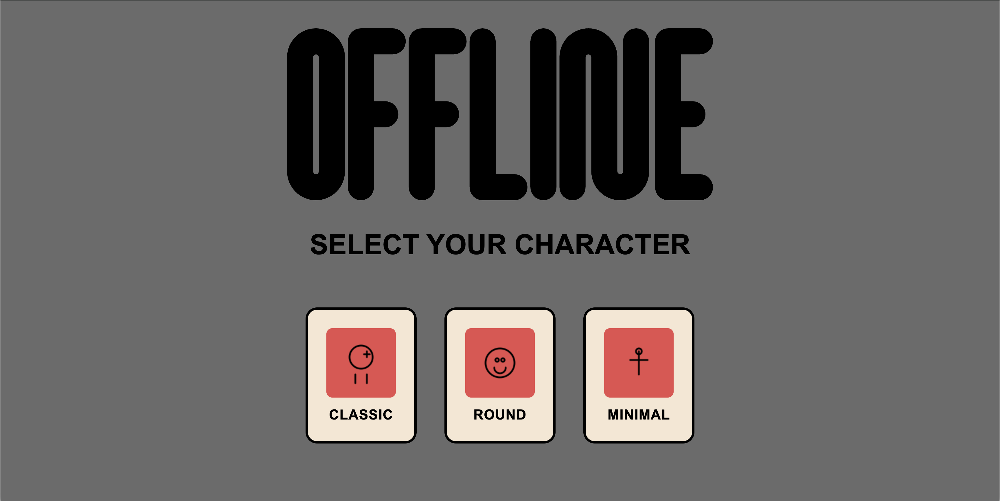
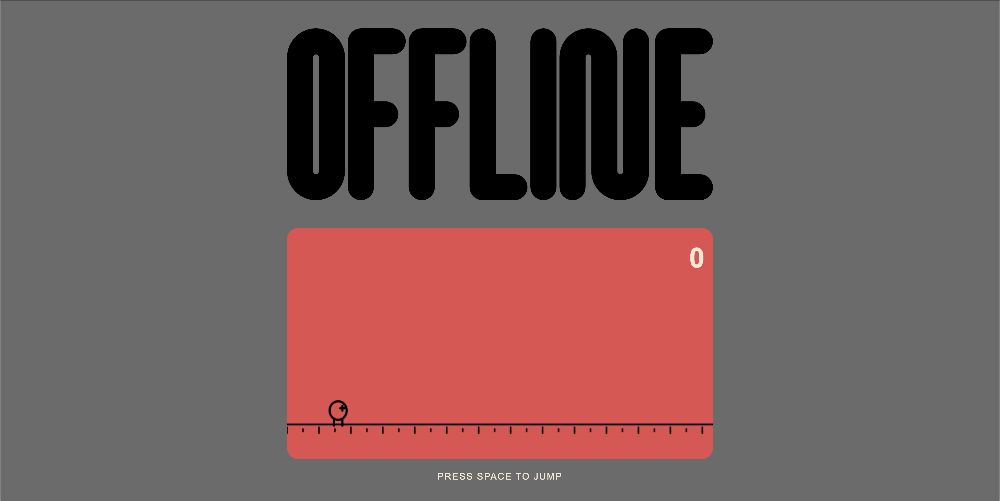
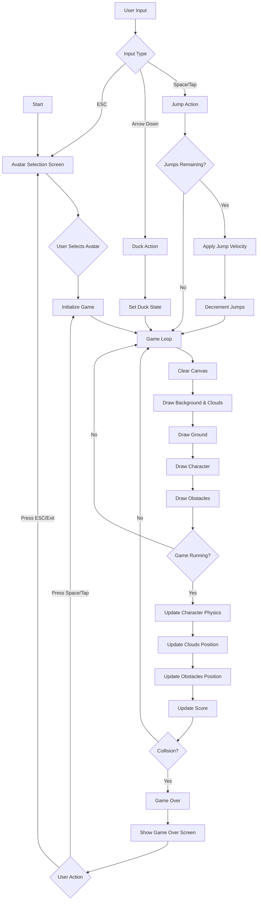

# Assignment 02: OFFLINE - Endless Runner Game

## Brief
Choose a "mini-game" to rebuild with HTML, CSS and JavaScript. The requirements are:
- The webpage should be responsive 
- Choose an avatar at the beginning of the game
- Keep track of the score of the player
- Use the keyboard to control the game (indicate what are the controls in the page). You can also use buttons (mouse), but also keyboard
- Use some multimedia files (audio, video, …)
- Implement an "automatic restart" in the game (that is not done via the refresh of the page)

## Screenshots

### Avatar Selection

### Game Play

## Project Description

OFFLINE is an endless runner game featuring three playable characters with jump and duck mechanics, including double jump. The game uses HTML5 Canvas for rendering with a minimalist hand-drawn aesthetic. The game loop manages physics, obstacle generation, collision detection, and score tracking with adaptive difficulty. Responsive design supports both keyboard (Space/Arrow Down/ESC) and touch controls, with optimized parameters for mobile/desktop. Sound effects enhance gameplay, while clean UI manages avatar selection, gameplay, and game over states.

## Screenshots

### Grid View

### List View

### Edit Panel

## Project Description

The PinBoard application is an interactive web interface for managing digital notes/pins with customizable visual properties. Users can toggle between grid and list layouts, add new pins, remove existing ones, and edit pin content through a slide-up panel. The application features responsive design for mobile and tablet devices, with data persistence across browser sessions using localStorage and JSON file fallback. Functional logic includes DOM manipulation for dynamic pin creation/rendering, event handling for user interactions, and state management for pin data. Interaction modalities comprise click-to-edit pins, toggle switches for view modes, and form-based editing with real-time preview. (248 characters)

## Block Diagram

## Functions List

#### `setCanvasSize()`
- **Parameters**: None
- **Logic**: Detects device type (mobile/desktop), sets canvas dimensions and game parameters (speed, gravity, obstacle frequency) according to GAME_CONFIG
- **Returns**: void

#### `updateInstructions()`
- **Parameters**: None
- **Logic**: Updates instruction text based on device type (TAP for mobile, SPACE for desktop)
- **Returns**: void

#### `init()`
- **Parameters**: None
- **Logic**: Initializes application by setting canvas size, initializing avatar selection, attaching event listeners, and starting game loop
- **Returns**: void

#### `initAvatarSelection()`
- **Parameters**: None
- **Logic**: Sets up avatar selection screen by creating preview canvases and attaching click handlers to avatar buttons
- **Returns**: void

#### `setupAvatarPreviewCanvas(canvas)`
- **Parameters**: `canvas` (HTMLCanvasElement)
- **Logic**: Sets canvas internal dimensions to match CSS dimensions for proper scaling
- **Returns**: void

#### `selectAvatar(avatarType)`
- **Parameters**: `avatarType` (string: 'classic', 'round', or 'minimal')
- **Logic**: Stores selected avatar, plays selection sound, hides avatar selection screen, shows main game container
- **Returns**: void

#### `drawAvatarPreview(ctx, type)`
- **Parameters**: `ctx` (CanvasRenderingContext2D), `type` (string)
- **Logic**: Calculates scale and center position, calls appropriate avatar drawing function
- **Returns**: void

#### `drawClassicAvatar(ctx, centerX, centerY, scale)`
- **Parameters**: `ctx` (CanvasRenderingContext2D), `centerX` (number), `centerY` (number), `scale` (number)
- **Logic**: Draws classic avatar with head circle, eye cross, and two leg lines
- **Returns**: void

#### `drawRoundAvatar(ctx, centerX, centerY, scale)`
- **Parameters**: `ctx` (CanvasRenderingContext2D), `centerX` (number), `centerY` (number), `scale` (number)
- **Logic**: Draws round avatar with face circle, two eyes, and smile arc
- **Returns**: void

#### `drawMinimalAvatar(ctx, centerX, centerY, scale)`
- **Parameters**: `ctx` (CanvasRenderingContext2D), `centerX` (number), `centerY` (number), `scale` (number)
- **Logic**: Draws minimal avatar with vertical body line, horizontal arms line, and head circle
- **Returns**: void

#### `drawCharacter()`
- **Parameters**: None
- **Logic**: Saves canvas context, sets drawing styles, calls character-specific drawing function based on selectedAvatar, restores context
- **Returns**: void

#### `drawClassicCharacter()`
- **Parameters**: None
- **Logic**: Draws classic avatar in game, with different poses for ducking vs standing/jumping, includes animated legs
- **Returns**: void

#### `drawRoundCharacter()`
- **Parameters**: None
- **Logic**: Draws round avatar face with eyes and smile, adjusts size based on ducking state
- **Returns**: void

#### `drawMinimalCharacter()`
- **Parameters**: None
- **Logic**: Draws minimal stick figure with body, arms, and head, adjusts height based on ducking state
- **Returns**: void

#### `drawGround()`
- **Parameters**: None
- **Logic**: Draws main ground line and animated decorative ground details with scrolling effect
- **Returns**: void

#### `drawObstacles()`
- **Parameters**: None
- **Logic**: Iterates through obstacles array, calls appropriate drawing function based on obstacle type
- **Returns**: void

#### `drawPipeObstacle(obstacle)`
- **Parameters**: `obstacle` (object with x, y, width, height)
- **Logic**: Draws two rounded rectangles to create pipe appearance
- **Returns**: void

#### `drawGoombaObstacle(obstacle)`
- **Parameters**: `obstacle` (object with x, y, width, height)
- **Logic**: Calculates bounce animation, draws face circle with eyes and frown
- **Returns**: void

#### `drawClouds()`
- **Parameters**: None
- **Logic**: Iterates through clouds array, draws each cloud as three overlapping circles
- **Returns**: void

#### `createObstacle()`
- **Parameters**: None
- **Logic**: Randomly selects obstacle type (pipe or goomba), creates obstacle object with position and dimensions, adds to obstacles array
- **Returns**: void

#### `updateObstacles()`
- **Parameters**: None
- **Logic**: If game running, moves obstacles left by gameSpeed, filters out off-screen obstacles, creates new obstacle at regular intervals
- **Returns**: void

#### `createCloud()`
- **Parameters**: None
- **Logic**: Creates cloud object at random height and adds to clouds array
- **Returns**: void

#### `updateClouds()`
- **Parameters**: None
- **Logic**: If game running, moves clouds left at half gameSpeed, filters out off-screen clouds, creates new clouds periodically
- **Returns**: void

#### `updateCharacter()`
- **Parameters**: None
- **Logic**: If jumping, applies gravity to velocity, updates y position, checks ground collision and resets jump state
- **Returns**: void

#### `jump()`
- **Parameters**: None
- **Logic**: If not ducking and jumps remaining > 0, applies jump velocity from config, sets jumping true, decrements jumps, plays jump sound
- **Returns**: void

#### `duck(isDucking)`
- **Parameters**: `isDucking` (boolean)
- **Logic**: If not jumping, sets character ducking state
- **Returns**: void

#### `checkCollision()`
- **Parameters**: None
- **Logic**: Creates character hitbox adjusted for ducking, checks intersection with each obstacle using bounding box collision
- **Returns**: boolean (true if collision detected)

#### `updateScore()`
- **Parameters**: None
- **Logic**: If game running, increments score, displays floor division by 10, calls increaseDifficulty every 500 points
- **Returns**: void

#### `increaseDifficulty()`
- **Parameters**: None
- **Logic**: Gets config for current device, increases gameSpeed and decreases obstacleFrequency up to minimum threshold
- **Returns**: void

#### `gameOver()`
- **Parameters**: None
- **Logic**: Stops game, disables controls for 1 second, shows game over screen, applies visual effects, plays game over sound
- **Returns**: void

#### `resetGame()`
- **Parameters**: None
- **Logic**: Resets score, frameCount, arrays, gets config for device, resets character position and state, hides game over screen
- **Returns**: void

#### `playSound(audio)`
- **Parameters**: `audio` (HTMLAudioElement)
- **Logic**: Resets audio to start and plays, catches and logs any play errors
- **Returns**: void

#### `exitToAvatarSelection()`
- **Parameters**: None
- **Logic**: Hides game container, shows avatar selection, resets all game state, clears arrays, resets character
- **Returns**: void

#### `gameLoop()`
- **Parameters**: None
- **Logic**: Clears canvas with red background, draws all game elements in order, if game running updates all game state and checks collision, requests next animation frame
- **Returns**: void

#### `handleKeyDown(e)`
- **Parameters**: `e` (KeyboardEvent)
- **Logic**: Handles Escape (exit), Space (jump/restart), and Arrow Down (duck) key presses
- **Returns**: void

#### `handleKeyUp(e)`
- **Parameters**: `e` (KeyboardEvent)
- **Logic**: Handles Arrow Down release to stop ducking
- **Returns**: void

#### `handleTouchStart(e)`
- **Parameters**: `e` (TouchEvent)
- **Logic**: Prevents default, if controls not disabled jumps or resets game based on game state
- **Returns**: void

#### `handleTouchEnd(e)`
- **Parameters**: `e` (TouchEvent)
- **Logic**: Prevents default touch behavior
- **Returns**: void

## Content and Data Sources

- **Audio Files**: Local assets stored in `assets/audio/`
  - `jump.wav` - Jump sound effect
  - `gameover.wav` - Game over sound effect
  - `select.wav` - Avatar selection sound effect

- **Graphics**: Vector graphics stored in `assets/img/`
  - `logo.svg` - Game logo
  - `favicon.svg` - Browser favicon

- **Styling**: CSS custom properties defined in `assets/css/global.css` for theming

- **Game Data**: No external data sources - all game logic and configurations are hardcoded in JavaScript

## API Documentation

This application does not use external APIs. It uses native browser APIs:

- **Canvas API** (`HTMLCanvasElement`, `CanvasRenderingContext2D`): For rendering all game graphics
- **Web Audio API** (`HTMLAudioElement`): For playing sound effects
- **DOM API** (`document.querySelector()`, `addEventListener()`): For UI manipulation and event handling
- **Animation API** (`requestAnimationFrame()`): For smooth 60 FPS game loop

## Licence
2025 (c) Mattia Piatti. All rights reserved. License: None
