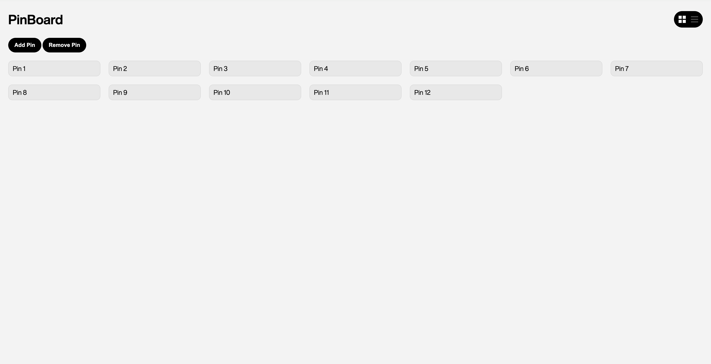
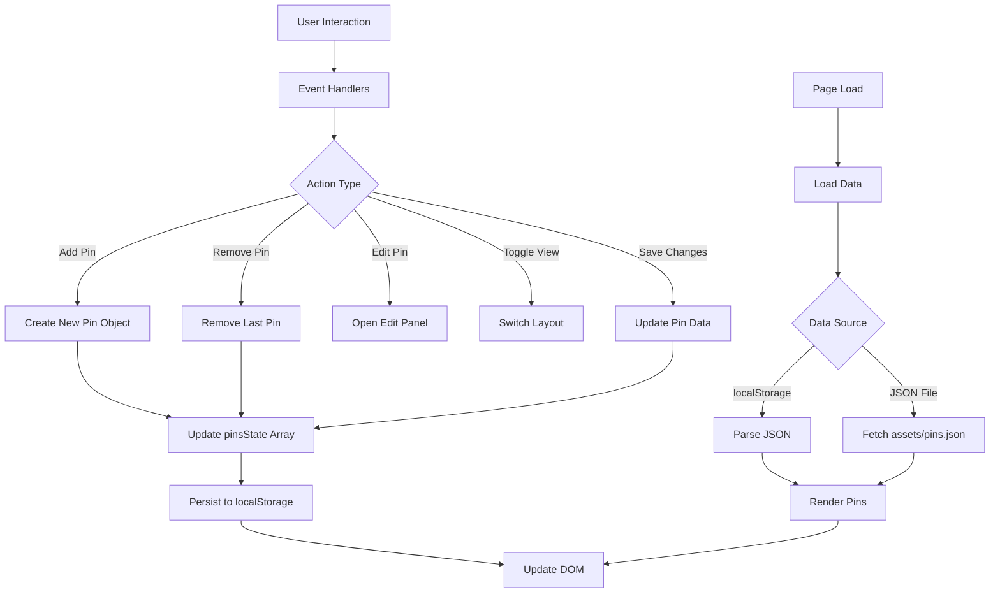

# Exercise 01: PinBoard Interactive Web Application

## Brief
Starting from the concept of a pinboard, implement a web page that:
- is responsive (properly layout for smartphone, tablet, and desktop)
- allows the user to add and remove elements
- allows the user to customize elements (i.e. colors, size)
- allows the switch between two views (at least)

## Screenshots

### Grid View

### List View

### Edit Panel

## Project Description

The PinBoard application is an interactive web interface for managing digital notes/pins with customizable visual properties. Users can toggle between grid and list layouts, add new pins, remove existing ones, and edit pin content through a slide-up panel. The application features responsive design for mobile and tablet devices, with data persistence across browser sessions using localStorage and JSON file fallback. Functional logic includes DOM manipulation for dynamic pin creation/rendering, event handling for user interactions, and state management for pin data. Interaction modalities comprise click-to-edit pins, toggle switches for view modes, and form-based editing with real-time preview. (248 characters)

## Block Diagram

## Functions List

### `toggleView()`
- **Arguments**: None
- **Description**: Toggles between grid and list view modes by adding/removing CSS classes
- **Returns**: void

### `openEditPanel(pinElement)`
- **Arguments**: `pinElement` (DOM element) - The pin element being edited
- **Description**: Opens the edit panel and populates it with current pin data
- **Returns**: void

### `closeEditPanel()`
- **Arguments**: None
- **Description**: Closes the edit panel and resets editing state
- **Returns**: void

### `savePin()`
- **Arguments**: None
- **Description**: Saves changes from edit panel to pin data and updates DOM/localStorage
- **Returns**: void

### `loadPins()`
- **Arguments**: None
- **Description**: Loads pin data from localStorage or JSON file and renders pins to DOM
- **Returns**: Promise<void>

## Content and Data Sources

- **Initial Pin Data**: `assets/pins.json` - Contains default pin objects with id, text, size, color, and bold properties
- **Persistent Data**: Browser localStorage - Stores pin state between sessions
- **Icons**: Inline SVG icons for grid/list toggle switch
- **Styling**: CSS custom properties for consistent theming

## API Documentation

No external APIs are used in this application. The application uses native browser APIs:

- **localStorage API**: For client-side data persistence
  - `localStorage.getItem(key)` - Retrieves stored data
  - `localStorage.setItem(key, value)` - Stores data

- **Fetch API**: For loading initial JSON data
  - `fetch(url)` - Loads JSON file from assets directory

- **DOM API**: For dynamic element manipulation
  - `document.createElement()` - Creates new pin elements
  - `document.querySelector()` - Selects DOM elements
  - `addEventListener()` - Attaches event handlers

## Licence
2025 (c) Mattia Piatti. All rights reserved. License: None
